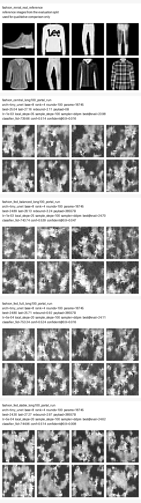
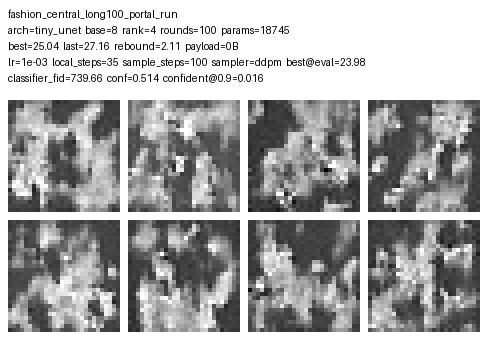
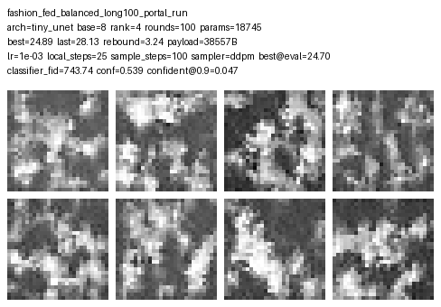
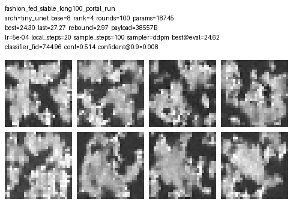
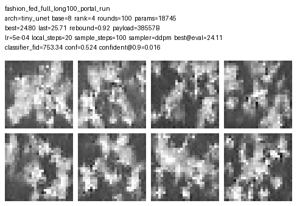

# Fashion-MNIST 100轮长线对比

## Key findings

- Best best-proxy-FID: `fashion_fed_stable_long100_portal_run` (24.3006)
- Best final-round proxy-FID: `fashion_fed_full_long100_portal_run` (25.7129)
- Best late-stage stability: `fashion_fed_full_long100_portal_run` (rebound=0.9160, tail_std=0.5336)
- Best semantic quality by classifier-FID: `fashion_central_long100_portal_run` (739.6633)

## Metrics

| run | checkpoint | rounds | lr | local_steps | sample_steps | best_proxy_fid | last_proxy_fid | proxy_eval_fid | classifier_fid | conf_mean | confident@0.9 | rebound | payload_bytes_raw |
| --- | --- | ---: | ---: | ---: | ---: | ---: | ---: | ---: | ---: | ---: | ---: | ---: | ---: |
| fashion_central_long100_portal_run | best | 100 | 1e-03 | 35 | 100 | 25.0434 | 27.1580 | 23.9771 | 739.6633 | 0.5138 | 0.0156 | 2.1146 | 0 |
| fashion_fed_balanced_long100_portal_run | best | 100 | 1e-03 | 25 | 100 | 24.8864 | 28.1287 | 24.6990 | 743.7422 | 0.5390 | 0.0469 | 3.2423 | 38557 |
| fashion_fed_stable_long100_portal_run | best | 100 | 5e-04 | 20 | 100 | 24.3006 | 27.2684 | 24.6159 | 744.9588 | 0.5140 | 0.0078 | 2.9678 | 38557 |
| fashion_fed_full_long100_portal_run | best | 100 | 5e-04 | 20 | 100 | 24.7970 | 25.7129 | 24.1089 | 753.3426 | 0.5242 | 0.0156 | 0.9160 | 38557 |

## Qualitative panels

The real reference row comes from the evaluation split. Each run row uses the same `sample_steps` value shown in the table, so the visual comparison and the recomputed proxy FID share the same sampling budget.
Checkpoint selection for this report: `best`.

### fashion_central_long100_portal_run

### fashion_fed_balanced_long100_portal_run

### fashion_fed_stable_long100_portal_run

### fashion_fed_full_long100_portal_run

