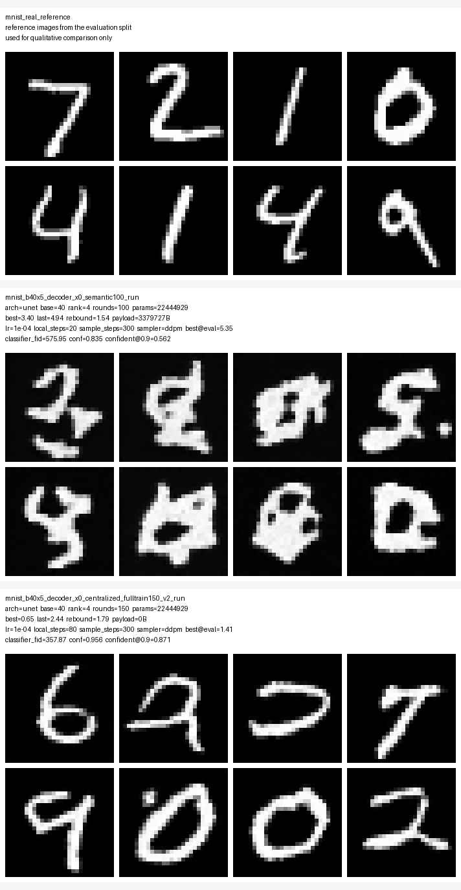
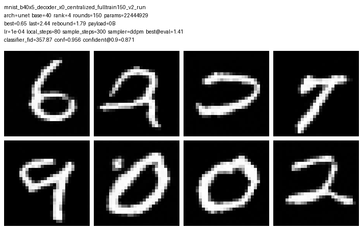
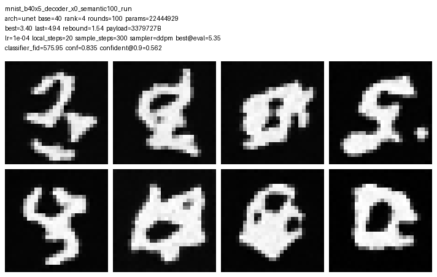

# MNIST b40x5 federated vs centralized full-train best checkpoint comparison

## Key findings

- Best best-proxy-FID: `mnist_b40x5_decoder_x0_centralized_fulltrain150_v2_run` (0.6504)
- Best final-round proxy-FID: `mnist_b40x5_decoder_x0_centralized_fulltrain150_v2_run` (2.4386)
- Best late-stage stability: `mnist_b40x5_decoder_x0_semantic100_run` (rebound=1.5353, tail_std=0.8640)
- Best semantic quality by classifier-FID: `mnist_b40x5_decoder_x0_centralized_fulltrain150_v2_run` (357.8714)

## Metrics

| run | checkpoint | rounds | lr | local_steps | sample_steps | best_proxy_fid | last_proxy_fid | proxy_eval_fid | classifier_fid | conf_mean | confident@0.9 | rebound | payload_bytes_raw |
| --- | --- | ---: | ---: | ---: | ---: | ---: | ---: | ---: | ---: | ---: | ---: | ---: | ---: |
| mnist_b40x5_decoder_x0_centralized_fulltrain150_v2_run | best | 150 | 1e-04 | 80 | 300 | 0.6504 | 2.4386 | 1.4076 | 357.8714 | 0.9559 | 0.8711 | 1.7882 | 0 |
| mnist_b40x5_decoder_x0_semantic100_run | best | 100 | 1e-04 | 20 | 300 | 3.4040 | 4.9393 | 5.3461 | 575.9547 | 0.8354 | 0.5625 | 1.5353 | 3379727 |

## Qualitative panels

The real reference row comes from the evaluation split. Each run row uses the same `sample_steps` value shown in the table, so the visual comparison and the recomputed proxy FID share the same sampling budget.
Checkpoint selection for this report: `best`.

### mnist_b40x5_decoder_x0_centralized_fulltrain150_v2_run

### mnist_b40x5_decoder_x0_semantic100_run

